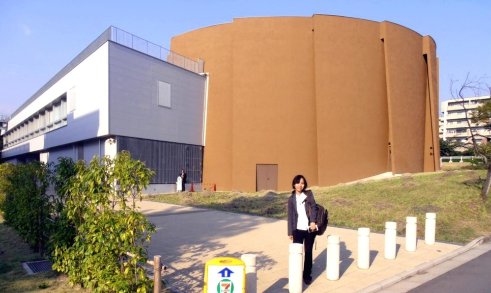
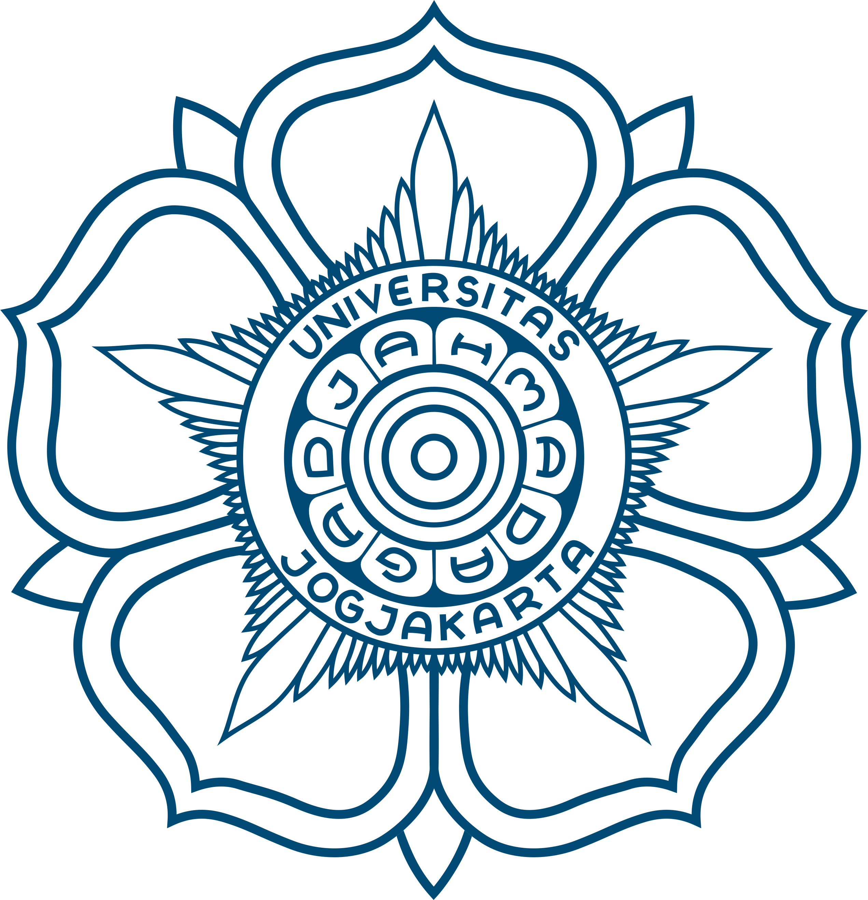
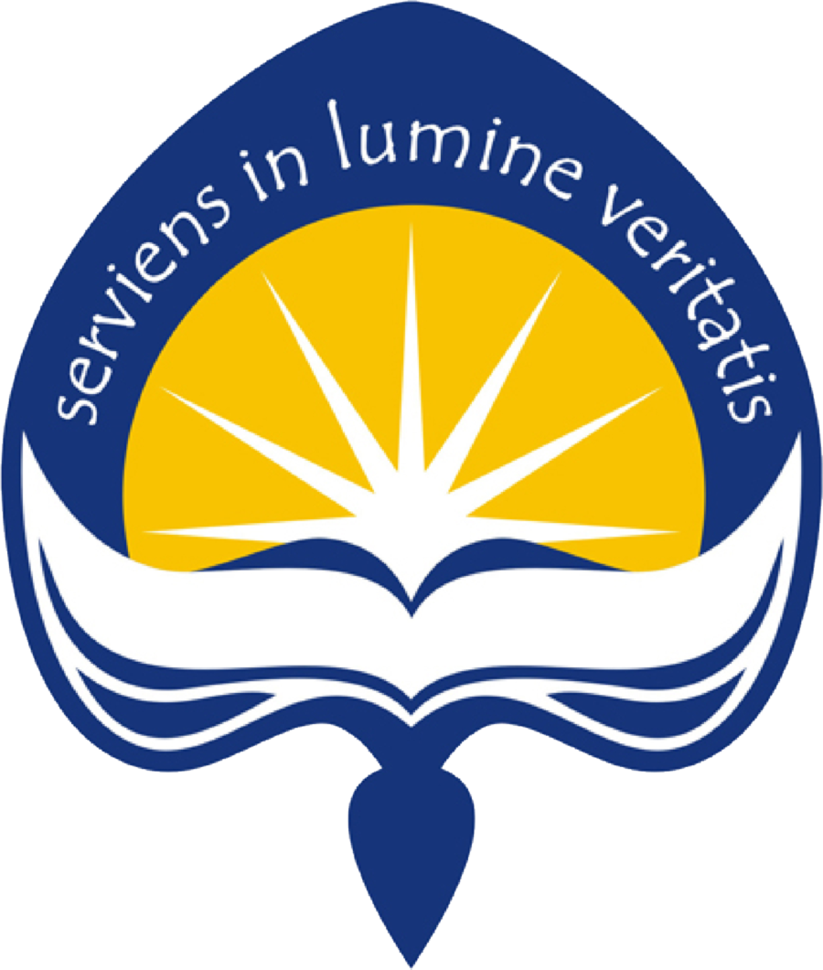

 

# Catharina Dwi Astuti Depari

### :office: **Office Address**
**Universitas Atma Jaya Yogyakarta**  *Department of Architecture Faculty of Engineering*  *Jalan Babarsari No.44 Yogyakarta, Indonesia, 55581*

### :school: School Address
**University of Washington**  *Department of Urban Design and Planning Gould Hall*   *3950 University Way NE, Seattle, Washington, 98105*

### :telephone: Contact
Mobile Phone: (208) 596-8354   E-mail: cd65@uw.edu

https://www.aminef.or.id/catharina-dwi-astuti-depari/  http://ft.uajy.ac.id/fakultas-teknik/arsitek/dosen-tetap-ars/   

## Qualifications

AutoCad, ArcGIS, CorelDraw, R-Studio, AdobePhotoshop, SketchUp

## Work Experience

- **2010-recent**   Lecturer at the Department of Architecture, UAJY, Yogyakarta, Indonesia

- **2010-2016**   Research Assistant in the Ministry of Public Works, Indonesia

- **2007-2010**   Lecturer Assistant in Planning Studio, UGM, Yogyakarta, Indonesia

- **2006-2007**   Research Assistant for UGM's Earthquake Hazard Mitigations Programs

- **2005-2007**   Architecture Supervisor at Adjisaka Construction Management Consultant

## Education
### University of Washington (Seattle, WA)   
>##### Department of Urban Design and Planning   Ph.D. Student (2018-recent)  

- *Team Member* of UW's Community Based Planning for Hazards Mitigations in Westport,   Grays Harbor County, WA
- *Fulbright Scholarship Awardee* for Ph.D. Degree education in the U.S. universities

##### Institutional Link: [University of Washington](http://urbdp.be.washington.edu/)

### Universitas Gadjah Mada (Java, Indonesia)  
>##### Department of Urban Design and Planning [public university, founded in 1949]  M.Eng. (2006-2007) 

- *Team Member* of UGM's Global Design Studio of the Urban Revitalization Project for Old Algiers District   in New Orleans Post Hurricane Katrina
- *Summa Cum Laude Recipient* in Master Degree Graduation
- *Teaching Assistant* for Studio of Urban Planning I-III
- *Research Assistant* for Collaborative Research of UGM-Kobe University

##### Institutional Link: [Universitas Gadjah Mada](http://archiplan.ugm.ac.id/en/programmes1/architecture/)

### Universitas Atma Jaya Yogyakarta (Java, Indonesia)   
>#####  Department of Architecture [private university, founded in 1965]   B.A. (1997-2005) 

- *Best Final Project Awardee* for Undergraduate Thesis at UAJY in Academic Year of 2004/2005
- *Participant* of the UAJY's Community Development Program in Godean DIstrict, DIY

##### Institutional Link: [Universitas Atma Jaya Yogyakarta](http://www.uajy.ac.id/program-studi/sarjana/program-studi-arsitektur/) 

**Inspirational Quote**
>*We can easily forgive a child who is afraid of the dark;   the real tragedy of life is when men are afraid of the light. (Plato, Ancient Greek Philosopher)*
