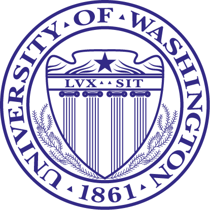

# Catharina Dwi Astuti Depari

**University of Washington**   *Department of Urban Design and Planning Gould Hall*   *3950 University Way NE, Seattle, Washington, 98105*

(208) 596-8354   cd65@uw.edu

https://www.slideshare.net/AriDjatmiko1/2-catharina-deparitransformasiruang   http://www.linkedin.com/in/catharina-depari-4294277a/

## Summary

Qualifications : AutoCad, ArcGIS, CorelDraw, AdobePhotoshop, SketchUp

## Work Experience
#### Research & Projects
**2011-recent**    Lecturer at the Department of Architecture, UAJY, Yogyakarta, Indonesia

**2011-2016**   Research Assistant in the Ministry of Public Works, Indonesia   Urban Planning Team Member for Master Plans in Jambi, Gunung Kidul, Siak Districts

**2007-2010**   Lecturer Assistant in Planning Studio, UGM, Yogyakarta, Indonesia

**2006-2007**   Research Assistant in Earthquake Hazard Mitigations, UGM, Yogyakarta

**2005-2007**   Architecture Supervisor for Construction Management PT. Adjisaka Technic Consultant

## Education

#### University of Washington (Seattle, WA)
  

##### Department of Urban Design and Planning   Ph.D. Student (2008 - recent)

- *Team Member* of UW's Studio of Planning in Westport, Gray Harbor, WA
- *Fulbright Scholarship Awardee* for Ph.D. degree education in the U.S.

#### Universitas Gadjah Mada (Yogyakarta, Indonesia)
  

##### Department of Architecture and Planning [public university, founded in 1949]   M.Eng. (2006-2007)

- *Team Member* of UGM's Global Design Studio of the Urban Revitalization Project for Old Algiers District in New Orleans Post Hurricane Katrina
- *Summa Cum Laude* Recipient in Master Degree Graduation
- *Teaching Assistant* for Studio of Urban Planning I-III
- *Research Assistant* for Collaborative Research of UGM-Kobe University

#### Universitas Atma Jaya Yogyakarta (Java, Indonesia)
  

##### [UAJY, Department of Architecture][private university, founded in 1965]   B.A. (1997-2005)

- *Best Final Project* for Undergraduate Thesis in Academic Year of 2005
- *Participant* of the UAJY's Community Development Program in Godean, DIY

*Links*
[University of Washington](http://urbdp.be.washington.edu/)   [Universitas Gadjah Mada](http://archiplan.ugm.ac.id/en/programmes1/architecture/)   [Universitas Atma Jaya Yogyakarta](http://www.uajy.ac.id/program-studi/sarjana/program-studi-arsitektur/)

*Inspirational Quote*
>We can easily forgive a child who is afraid of the dark;
>the real tragedy of life is when men are afraid of the light.
>(Plato)
